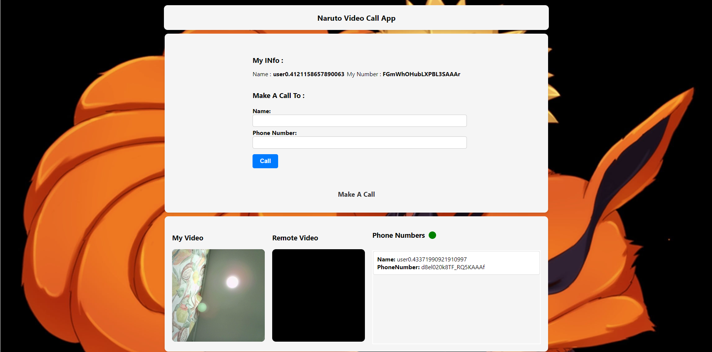
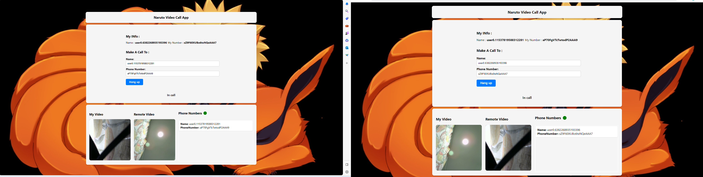

# Simple WebRTC Video Call App with Node.js Signaling Server

This is a simple video call application built using WebRTC (Web Real-Time Communication) and Node.js as the signaling server. The app allows users to make video calls to each other by selecting phone numbers from a list and provides basic call management features.


## Screen Shot


## Table of Contents

- [Simple WebRTC Video Call App with Node.js Signaling Server](#simple-webrtc-video-call-app-with-nodejs-signaling-server)
  - [Screen Shot](#screen-shot)
  - [Table of Contents](#table-of-contents)
  - [Features](#features)
  - [Getting Started](#getting-started)
    - [Prerequisites](#prerequisites)
    - [Installation](#installation)
    - [Running the App](#running-the-app)
  - [WebRTC Overview](#webrtc-overview)
  - [Signaling Server](#signaling-server)
  - [Future Improvements](#future-improvements)
  - [Calling Image](#calling-image)
  - [Incall Image](#incall-image)
  - [License](#license)

## Features

- User-friendly interface displaying a list of phone numbers to call.
- Initiating and receiving video calls between users.
- Hang-up button to end ongoing calls.
- Call status notifications for users in a call.
- Preventing multiple calls to the same user.

## Getting Started

### Prerequisites

- Node.js and npm installed on your system.
- Modern web browser with WebRTC support.

### Installation

1. Clone this repository:

   ```bash
   git clone https://github.com/yourusername/simple-webrtc-video-call-app.git
   ```

2. Navigate to the project directory:

   ```bash
   cd simple-webrtc-video-call-app
   ```

3. Install the required npm packages:

   ```bash
   npm install
   ```

### Running the App

1. Start the Node.js server:

   ```bash
   npm start
   ```

2. Open your web browser and go to `http://localhost:3000`.

3. Choose a phone number from the list and click the "Call" button to initiate a call.

4. To receive a call, open another browser window/tab and repeat the above steps.

5. During a call, you can use the "Hang Up" button to end the call.

## WebRTC Overview

WebRTC (Web Real-Time Communication) is a technology that enables real-time communication directly between web browsers and other applications. It allows for peer-to-peer audio, video, and data sharing without requiring any additional plugins or software.

Key components of WebRTC:

- **getUserMedia**: Accesses the user's camera and microphone to capture audio and video streams.

- **RTCPeerConnection**: Establishes a peer-to-peer connection between browsers for audio and video communication.

- **RTCDataChannel**: Enables low-latency, bidirectional communication for sending non-streaming data.

- **Signaling**: Exchange of metadata and control messages to establish and manage connections.

## Signaling Server

The signaling server plays a crucial role in establishing connections between peers using WebRTC. It helps facilitate the exchange of session descriptions, ICE candidates, and other control messages required to set up a connection.

In this app, the Node.js server acts as the signaling server. It handles:

- User registration and management.
- Distributing call invitations and notifications.
- Relaying messages between peers.

## Future Improvements

This simple video call app can be further enhanced by adding the following features:

- **User authentication**: Implement user authentication to secure the application.

- **Video quality settings**: Allow users to adjust video quality based on their network conditions.

- **Group calls**: Enable multiple users to join the same call, creating group video conferencing.

- **Screen sharing**: Add the ability to share screens during a call.

- **Call recording**: Implement call recording functionality.

## Calling Image


## Incall Image


## License

This project is licensed under the MIT License - see the [LICENSE](LICENSE) file for details.

---

Feel free to explore, modify, and build upon this simple WebRTC video call app! If you have any questions or suggestions, please don't hesitate to reach out.